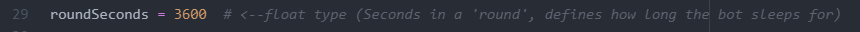

# [@Joh5Bot](https://twitter.com/joh5bot) - Crowdsourced Perpetual Futures

## What is this?

@Joh5Bot is a twitter bot with access to a cryptocurrency exchange and a wallet. The bot waits for tweet "mentions" in the format below, and counts each tweet as a vote. Every hour, the bot tallies the votes and decides whether to long or short a suggested currency. The bot then takes market order on the given currency for 15% of the total account's balance, using 10x leverage. The bot then "sleeps" for exactly one hour, then closes the open position with a market order. This process repeats itself every hour.

**Ruleset:**

If no votes are cast, or no coins are suggested, the bot takes no position and updates its balance and profile picture to a neutral white.

If an equal number of buy and sell votes are cast, the bot takes no position and updates its balance and profile picture to a neutral white.

When the bot is long, the profile picture is green. Inversely, when the bot is short, the profile picture is red.

The bot is running using the minimum balance as I develop it. I may stop or put the bot in test modes at my discretion. I may add to the account at such time that any potential bugs or behavioral errors have been squashed. These rules may be augmented as I do or don't develop this out.

**The code for this project is avalible on [my GitHub](https://github.com/JohnKearney1/Joh5Bot). See below for usage.**

## Tweet Me!  

**Format:** `@Joh5Bot (#buy/#sell) <Coin Symbol>`  
*Insert a coin symbol from the table below!*

**Example 1:** `@Joh5Bot #buy LINKUSDT`  
*[Try](https://twitter.com/intent/tweet?text=@Joh5Bot%20#buy%20LINKUSDT&related=joh5bot) a simple buy vote for ChainLink*

**Example 2:** `@Joh5Bot #sell etH`  
*Capitalization is irrelevant*

**Do Not:** `@Joh5Bot #Buy $ALICE/USD`  
*Coin Symbols must be from the list below, no slashes are required, and no operator is necessary*

## Symbol List  

| Coin Symbol | Min. Notional | Min. Price Movement | Order Cap Price Ratio | Order Price Floor Ratio | Max Market Order Qty. | Max Open Order Qty. | Price Protection Threshold | Min. Notional Value|
|---------------------	|------------	|---------------	|-----	|-----	|---------------	|-----	|-----	|--------	|
| BTCUSDT     	| 0.001 BTC  	| 0.01 USDT     	| 15% 	| 15% 	| 1000 BTC      	| 200 	| 5%  	| 5 USDT 	|
| ETHUSDT     	| 0.001 ETH  	| 0.01 USDT     	| 15% 	| 15% 	| 10000 ETH     	| 200 	| 5%  	| 5 USDT 	|
| BCHUSDT     	| 0.001 BCH  	| 0.01 USDT     	| 15% 	| 15% 	| 1000 BCH      	| 200 	| 5%  	| 5 USDT 	|
| XRPUSDT     	| 0.1 XRP    	| 0.0001 USDT   	| 15% 	| 15% 	| 1000000 XRP   	| 200 	| 5%  	| 5 USDT 	|
| EOSUSDT     	| 0.1 EOS    	| 0.001 USDT    	| 15% 	| 15% 	| 200000 EOS    	| 200 	| 5%  	| 5 USDT 	|
| LTCUSDT     	| 0.001 LTC  	| 0.01 USDT     	| 15% 	| 15% 	| 10000 LTC     	| 200 	| 5%  	| 5 USDT 	|
| TRXUSDT     	| 1 TRX      	| 0.00001 USDT  	| 15% 	| 15% 	| 10000000 TRX  	| 200 	| 5%  	| 5 USDT 	|
| ETCUSDT     	| 0.01 ETC   	| 0.001 USDT    	| 15% 	| 15% 	| 100000 ETC    	| 200 	| 5%  	| 5 USDT 	|
| LINKUSDT    	| 0.01 LINK  	| 0.001 USDT    	| 15% 	| 15% 	| 100000 LINK   	| 200 	| 5%  	| 5 USDT 	|
| XLMUSDT     	| 1 XLM      	| 0.00001 USDT  	| 15% 	| 15% 	| 1000000 XLM   	| 200 	| 5%  	| 5 USDT 	|
| ADAUSDT     	| 1 ADA      	| 0.00001 USDT  	| 15% 	| 15% 	| 10000000 ADA  	| 200 	| 5%  	| 5 USDT 	|
| XMRUSDT     	| 0.001 XMR  	| 0.01 USDT     	| 15% 	| 15% 	| 10000 XMR     	| 200 	| 5%  	| 5 USDT 	|
| DASHUSDT    	| 0.001 DASH 	| 0.01 USDT     	| 15% 	| 15% 	| 3000 DASH     	| 200 	| 15% 	| 5 USDT 	|
| ZECUSDT     	| 0.001 ZEC  	| 0.01 USDT     	| 15% 	| 15% 	| 10000 ZEC     	| 200 	| 15% 	| 5 USDT 	|
| XTZUSDT     	| 0.1 XTZ    	| 0.001 USDT    	| 15% 	| 15% 	| 600000 XTZ    	| 200 	| 5%  	| 5 USDT 	|
| BNBUSDT     	| 0.01 BNB   	| 0.001 USDT    	| 15% 	| 15% 	| 20000 BNB     	| 200 	| 5%  	| 5 USDT 	|
| ATOMUSDT    	| 0.01 ATOM  	| 0.001 USDT    	| 15% 	| 15% 	| 100000 ATOM   	| 200 	| 15% 	| 5 USDT 	|
| ONTUSDT     	| 0.1 ONT    	| 0.0001 USDT   	| 15% 	| 15% 	| 500000 ONT    	| 200 	| 15% 	| 5 USDT 	|
| IOTAUSDT    	| 0.1 IOTA   	| 0.0001 USDT   	| 15% 	| 15% 	| 200000 IOTA   	| 200 	| 15% 	| 5 USDT 	|
| BATUSDT     	| 0.1 BAT    	| 0.0001 USDT   	| 15% 	| 15% 	| 1000000 BAT   	| 200 	| 15% 	| 5 USDT 	|
| VETUSDT     	| 1 VET      	| 0.000001 USDT 	| 15% 	| 15% 	| 10000000 VET  	| 200 	| 15% 	| 5 USDT 	|
| NEOUSDT     	| 0.01 NEO   	| 0.001 USDT    	| 15% 	| 15% 	| 20000 NEO     	| 200 	| 15% 	| 5 USDT 	|
| QTUMUSDT    	| 0.1 QTUM   	| 0.001 USDT    	| 15% 	| 15% 	| 100000 QTUM   	| 200 	| 15% 	| 5 USDT 	|
| IOSTUSDT    	| 1 IOST     	| 0.000001 USDT 	| 15% 	| 15% 	| 10000000 IOST 	| 200 	| 15% 	| 5 USDT 	|
| THETAUSDT   	| 0.1 THETA  	| 0.0001 USDT   	| 15% 	| 15% 	| 400000 THETA  	| 200 	| 15% 	| 5 USDT 	|
| ALGOUSDT    	| 0.1 ALGO   	| 0.0001 USDT   	| 15% 	| 15% 	| 1000000 ALGO  	| 200 	| 15% 	| 5 USDT 	|
| ZILUSDT     	| 1 ZIL      	| 0.00001 USDT  	| 15% 	| 15% 	| 5000000 ZIL   	| 200 	| 15% 	| 5 USDT 	|
| KNCUSDT     	| 1 KNC      	| 0.00001 USDT  	| 15% 	| 15% 	| 300000 KNC    	| 200 	| 15% 	| 5 USDT 	|
| ZRXUSDT     	| 0.1 ZRX    	| 0.0001 USDT   	| 15% 	| 15% 	| 500000 ZRX    	| 200 	| 15% 	| 5 USDT 	|
| COMPUSDT    	| 0.001 COMP 	| 0.01 USDT     	| 15% 	| 15% 	| 2500 COMP     	| 200 	| 15% 	| 5 USDT 	|
| OMGUSDT     	| 0.1 OMG    	| 0.0001 USDT   	| 15% 	| 15% 	| 200000 OMG    	| 200 	| 15% 	| 5 USDT 	|
| DOGEUSDT    	| 1 DOGE     	| 0.000001 USDT 	| 15% 	| 15% 	| 5000000 DOGE  	| 200 	| 15% 	| 5 USDT 	|
| SXPUSDT     	| 0.1 SXP    	| 0.0001 USDT   	| 15% 	| 15% 	| 500000 SXP    	| 200 	| 15% 	| 5 USDT 	|
| KAVAUSDT    	| 0.1 KAVA   	| 0.0001 USDT   	| 15% 	| 15% 	| 250000 KAVA   	| 200 	| 15% 	| 5 USDT 	|
| BANDUSDT    	| 0.1 BAND   	| 0.0001 USDT   	| 15% 	| 15% 	| 100000 BAND   	| 200 	| 15% 	| 5 USDT 	|
| RLCUSDT     	| 0.1 RLC    	| 0.0001 USDT   	| 15% 	| 15% 	| 300000 RLC    	| 200 	| 15% 	| 5 USDT 	|
| WAVESUSDT   	| 0.1 WAVES  	| 0.0001 USDT   	| 15% 	| 15% 	| 70000 WAVES   	| 200 	| 15% 	| 5 USDT 	|
| MKRUSDT     	| 0.001 MKR  	| 0.01 USDT     	| 15% 	| 15% 	| 250 MKR       	| 200 	| 15% 	| 5 USDT 	|
| SNXUSDT     	| 0.1 SNX    	| 0.001 USDT    	| 15% 	| 15% 	| 40000 SNX     	| 200 	| 15% 	| 5 USDT 	|
| DOTUSDT     	| 0.1 DOT    	| 0.001 USDT    	| 15% 	| 15% 	| 200000 DOT    	| 200 	| 5%  	| 5 USDT 	|
| DEFIUSDT    	| 0.001 DEFI 	| 0.1 USDT      	| 15% 	| 15% 	| 300 DEFI      	| 200 	| 15% 	| 5 USDT 	|
| YFIUSDT     	| 0.001 YFI  	| 0.1 USDT      	| 15% 	| 15% 	| 50 YFI        	| 200 	| 15% 	| 5 USDT 	|
| BALUSDT     	| 0.1 BAL    	| 0.001 USDT    	| 15% 	| 15% 	| 20000 BAL     	| 200 	| 15% 	| 5 USDT 	|
| CRVUSDT     	| 0.1 CRV    	| 0.001 USDT    	| 15% 	| 15% 	| 300000 CRV    	| 200 	| 15% 	| 5 USDT 	|
| TRBUSDT     	| 0.1 TRB    	| 0.001 USDT    	| 15% 	| 15% 	| 15000 TRB     	| 200 	| 15% 	| 5 USDT 	|
| YFIIUSDT    	| 0.001 YFII 	| 0.1 USDT      	| 15% 	| 15% 	| 100 YFII      	| 200 	| 15% 	| 5 USDT 	|
| RUNEUSDT    	| 1 RUNE     	| 0.0001 USDT   	| 15% 	| 15% 	| 250000 RUNE   	| 200 	| 15% 	| 5 USDT 	|
| SUSHIUSDT   	| 1 SUSHI    	| 0.0001 USDT   	| 15% 	| 15% 	| 100000 SUSHI  	| 200 	| 15% 	| 5 USDT 	|
| SRMUSDT     	| 1 SRM      	| 0.0001 USDT   	| 15% 	| 15% 	| 100000 SRM    	| 200 	| 15% 	| 5 USDT 	|
| BZRXUSDT    	| 1 BZRX     	| 0.0001 USDT   	| 15% 	| 15% 	| 1000000 BZRX  	| 200 	| 15% 	| 5 USDT 	|
| EGLDUSDT    	| 0.1 EGLD   	| 0.001 USDT    	| 15% 	| 15% 	| 10000 EGLD    	| 200 	| 15% 	| 5 USDT 	|
| SOLUSDT     	| 1 SOL      	| 0.0001 USDT   	| 15% 	| 15% 	| 100000 SOL    	| 200 	| 15% 	| 5 USDT 	|
| ICXUSDT     	| 1 ICX      	| 0.0001 USDT   	| 15% 	| 15% 	| 300000 ICX    	| 200 	| 15% 	| 5 USDT 	|
| STORJUSDT   	| 1 STORJ    	| 0.0001 USDT   	| 15% 	| 15% 	| 500000 STORJ  	| 200 	| 15% 	| 5 USDT 	|
| BLZUSDT     	| 1 BLZ      	| 0.00001 USDT  	| 15% 	| 15% 	| 2000000 BLZ   	| 200 	| 15% 	| 5 USDT 	|
| UNIUSDT     	| 1 UNI      	| 0.0001 USDT   	| 15% 	| 15% 	| 100000 UNI    	| 200 	| 15% 	| 5 USDT 	|
| AVAXUSDT    	| 1 AVAX     	| 0.0001 USDT   	| 15% 	| 15% 	| 25000 AVAX    	| 200 	| 15% 	| 5 USDT 	|
| FTMUSDT     	| 1 FTM      	| 0.000001 USDT 	| 15% 	| 15% 	| 1000000 FTM   	| 200 	| 15% 	| 5 USDT 	|
| HNTUSDT     	| 1 HNT      	| 0.0001 USDT   	| 15% 	| 15% 	| 75000 HNT     	| 200 	| 15% 	| 5 USDT 	|
| ENJUSDT     	| 1 ENJ      	| 0.00001 USDT  	| 15% 	| 15% 	| 1000000 ENJ   	| 200 	| 15% 	| 5 USDT 	|
| FLMUSDT     	| 1 FLM      	| 0.0001 USDT   	| 15% 	| 15% 	| 1000000 FLM   	| 200 	| 15% 	| 5 USDT 	|
| TOMOUSDT    	| 1 TOMO     	| 0.0001 USDT   	| 15% 	| 15% 	| 300000 TOMO   	| 200 	| 15% 	| 5 USDT 	|
| RENUSDT     	| 1 REN      	| 0.00001 USDT  	| 15% 	| 15% 	| 500000 REN    	| 200 	| 15% 	| 5 USDT 	|
| KSMUSDT     	| 0.1 KSM    	| 0.001 USDT    	| 15% 	| 15% 	| 5000 KSM      	| 200 	| 15% 	| 5 USDT 	|
| NEARUSDT    	| 1 NEAR     	| 0.0001 USDT   	| 15% 	| 15% 	| 250000 NEAR   	| 200 	| 15% 	| 5 USDT 	|
| AAVEUSDT    	| 0.1 AAVE   	| 0.001 USDT    	| 15% 	| 15% 	| 5000 AAVE     	| 200 	| 15% 	| 5 USDT 	|
| FILUSDT     	| 0.1 FIL    	| 0.001 USDT    	| 15% 	| 15% 	| 50000 FIL     	| 200 	| 15% 	| 5 USDT 	|
| RSRUSDT     	| 1 RSR      	| 0.000001 USDT 	| 15% 	| 15% 	| 10000000 RSR  	| 200 	| 15% 	| 5 USDT 	|
| LRCUSDT     	| 1 LRC      	| 0.00001 USDT  	| 15% 	| 15% 	| 700000 LRC    	| 200 	| 15% 	| 5 USDT 	|
| MATICUSDT   	| 1 MATIC    	| 0.00001 USDT  	| 15% 	| 15% 	| 5000000 MATIC 	| 200 	| 15% 	| 5 USDT 	|
| OCEANUSDT   	| 1 OCEAN    	| 0.00001 USDT  	| 15% 	| 15% 	| 200000 OCEAN  	| 200 	| 15% 	| 5 USDT 	|
| CVCUSDT     	| 1 CVC      	| 0.00001 USDT  	| 15% 	| 15% 	| 1000000 CVC   	| 200 	| 15% 	| 5 USDT 	|
| BELUSDT     	| 1 BEL      	| 0.00001 USDT  	| 15% 	| 15% 	| 200000 BEL    	| 200 	| 15% 	| 5 USDT 	|
| CTKUSDT     	| 1 CTK      	| 0.00001 USDT  	| 15% 	| 15% 	| 150000 CTK    	| 200 	| 15% 	| 5 USDT 	|
| AXSUSDT     	| 1 AXS      	| 0.00001 USDT  	| 15% 	| 15% 	| 200000 AXS    	| 200 	| 15% 	| 5 USDT 	|
| ALPHAUSDT   	| 1 ALPHA    	| 0.00001 USDT  	| 15% 	| 15% 	| 500000 ALPHA  	| 200 	| 15% 	| 5 USDT 	|
| ZENUSDT     	| 0.1 ZEN    	| 0.001 USDT    	| 15% 	| 15% 	| 10000 ZEN     	| 200 	| 15% 	| 5 USDT 	|
| SKLUSDT     	| 1 SKL      	| 0.00001 USDT  	| 15% 	| 15% 	| 1000000 SKL   	| 200 	| 15% 	| 5 USDT 	|
| GRTUSDT     	| 1 GRT      	| 0.00001 USDT  	| 15% 	| 15% 	| 300000 GRT    	| 200 	| 15% 	| 5 USDT 	|
| 1INCHUSDT   	| 1 1INCH    	| 0.0001 USDT   	| 15% 	| 15% 	| 100000 1INCH  	| 200 	| 15% 	| 5 USDT 	|
| BTCBUSD     	| 0.001 BTC  	| 0.1 BUSD      	| 5%  	| 5%  	| 20 BTC        	| 200 	| 15% 	| 5 BUSD 	|
| AKROUSDT    	| 1 AKRO     	| 0.00001 USDT  	| 15% 	| 15% 	| 7000000 AKRO  	| 200 	| 15% 	| 5 USDT 	|
| CHZUSDT     	| 1 CHZ      	| 0.00001 USDT  	| 15% 	| 15% 	| 5000000 CHZ   	| 200 	| 15% 	| 5 USDT 	|
| SANDUSDT    	| 1 SAND     	| 0.00001 USDT  	| 15% 	| 15% 	| 1000000 SAND  	| 200 	| 15% 	| 5 USDT 	|
| ANKRUSDT    	| 1 ANKR     	| 0.000001 USDT 	| 15% 	| 15% 	| 5000000 ANKR  	| 200 	| 15% 	| 5 USDT 	|
| LUNAUSDT    	| 1 LUNA     	| 0.0001 USDT   	| 15% 	| 15% 	| 30000 LUNA    	| 200 	| 15% 	| 5 USDT 	|
| BTSUSDT     	| 1 BTS      	| 0.00001 USDT  	| 15% 	| 15% 	| 3000000 BTS   	| 200 	| 15% 	| 5 USDT 	|
| LITUSDT     	| 0.1 LIT   	| 0.001 USDT    	| 15% 	| 15% 	| 20000 LIT    	| 200 	| 15% 	| 5 USDT 	|
| UNFIUSDT    	| 0.1 UNFI  	| 0.001 USDT    	| 15% 	| 15% 	| 5000 UNFI    	| 200 	| 15% 	| 5 USDT 	|
| DODOUSDT    	| 0.1 DODO  	| 0.001 USDT    	| 15% 	| 15% 	| 100000 DODO  	| 200 	| 15% 	| 5 USDT 	|
| REEFUSDT    	| 1 REEF    	| 0.000001 USDT 	| 15% 	| 15% 	| 3000000 REEF 	| 200 	| 15% 	| 5 USDT 	|
| RVNUSDT     	| 1 RVN     	| 0.00001 USDT  	| 15% 	| 15% 	| 300000 RVN   	| 200 	| 15% 	| 5 USDT 	|
| SFPUSDT     	| 1 SFP     	| 0.0001 USDT   	| 15% 	| 15% 	| 100000 SFP   	| 200 	| 15% 	| 5 USDT 	|
| XEMUSDT     	| 1 XEM     	| 0.0001 USDT   	| 15% 	| 15% 	| 200000 XEM   	| 200 	| 15% 	| 5 USDT 	|
| BTCSTUSDT      	| 0.1 BTCST 	| 0.001 USDT    	| 15% 	| 15% 	| 1000 BTCST   	| 200 	| 15% 	| 5 USDT 	|
| COTIUSDT    	| 1 COTI    	| 0.00001 USDT  	| 15% 	| 15% 	| 500000 COTI  	| 200 	| 15% 	| 5 USDT 	|
| CHRUSDT     	| 1 CHR     	| 0.0001 USDT   	| 15% 	| 15% 	| 200000 CHR   	| 200 	| 15% 	| 5 USDT 	|
| MANAUSDT    	| 1 MANA    	| 0.0001 USDT   	| 15% 	| 15% 	| 100000 MANA  	| 200 	| 15% 	| 5 USDT 	|
| ALICEUSDT   	| 0.1 ALICE 	| 0.001 USDT    	| 15% 	| 15% 	| 10000 ALICE  	| 200 	| 15% 	| 5 USDT 	|
| HBARUSDT    	| 1 HBAR    	| 0.00001 USDT  	| 15% 	| 15% 	| 300000 HBAR  	| 200 	| 15% 	| 5 USDT 	|
| ONEUSDT     	| 1 ONE     	| 0.00001 USDT  	| 15% 	| 15% 	| 1000000 ONE  	| 200 	| 15% 	| 5 USDT 	|
| LINAUSDT    	| 1 LINA    	| 0.00001 USDT  	| 15% 	| 15% 	| 500000 LINA  	| 200 	| 15% 	| 5 USDT 	|
| STMXUSDT    	| 1 STMX    	| 0.00001 USDT  	| 15% 	| 15% 	| 1000000 STMX 	| 200 	| 15% 	| 5 USDT 	|

## Code Usage

> Requires Python >= 3.8

**1. Install requirements from within the directory:** `pip install -r requirements.txt`  
**2. Add your API keys to `API/binance.json` and `API/twitter.json`, leaving the quotation marks, and save.**
**3. Edit line 29 in main.py to your preferred round duration (in seconds).**  

**4. Run `python3 main.py` from the root directory. The bot will take its first poll immediately, then sleep.**
